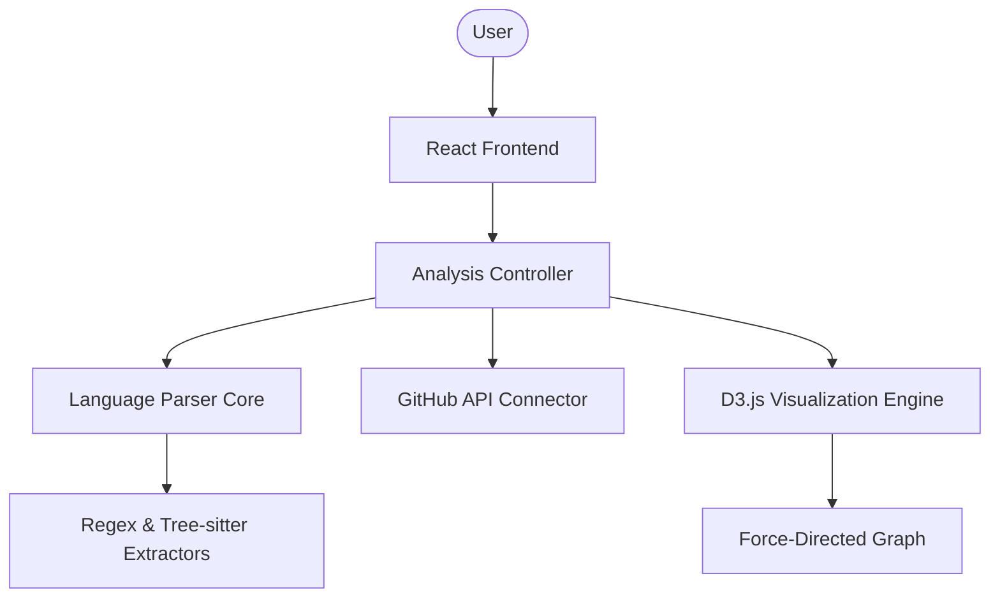

# Architecture Documentation

## System Overview

Codelyzer is architected as a **Static Monolith-Client** application. It operates entirely within the browser environment, leveraging modern Web APIs for repository interaction and local file processing.

### Component Diagram

## Core Modules

### 1. Language Parser Core (`index.html` logic)
The parser identifies structural entities (functions, classes, imports) across 30+ languages.
- **Static Analysis**: Uses optimized regular expressions for high-speed scanning.
- **Advanced Analysis**: Employs `web-tree-sitter` for complex language structures (where enabled).
- **Dependency Mapping**: Inferred via symbol resolution. If `File A` references a function defined in `File B`, a dependency edge is created.

### 2. Visualization Engine
Built on **D3.js v7**.
- **Force Simulation**: Uses `d3-force` to calculate node positions based on many-body forces and link constraints.
- **Layers**: Nodes are categorized into layers (UI, Logic, Service, Data, etc.) based on path patterns (defined in `Parser.detectLayer`).

### 3. Data Flow
1. **Fetch**: `fetch` API retrieves file tree and content (GitHub) or `FileSystemHandle` reads local bits.
2. **Process**: Parser extracts functions and connections.
3. **Metrication**: Calculates "Blast Radius" (out-degree impact) and "Health Grade" (circularity + coupling).
4. **Render**: D3 updates the DOM/SVG nodes.

## Architectural Decision Records (ADR)

### ADR-001: Single-File Distribution
- **Decision**: Ship the main application as a single `index.html`.
- **Rationale**: Zero-install requirement. Users can download and run it offline immediately.
- **Consequences**: CSS and JS are inlined; requires careful management of the 9000+ lines in `index.html`.

### ADR-002: Client-Side Only
- **Decision**: No backend server for analysis.
- **Rationale**: Privacy and security. Sensitive code never leaves the user's machine.
- **Consequences**: Limited by browser memory and CORS policies for some APIs.

## Visualization Modes

| Mode | Logic |
|------|-------|
| **Folder** | Clusters nodes by directory hierarchy. |
| **Layer** | Uses `detectLayer` patterns to group by architectural role. |
| **Blast** | Recursive depth-first search to find all downstream dependents. |
| **Churn** | Maps Git commit frequency to color scales (Red = Hot). |
